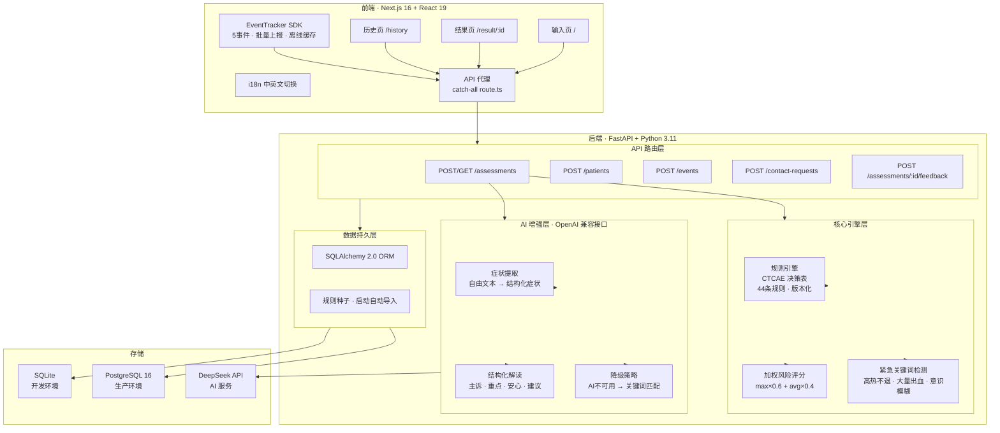
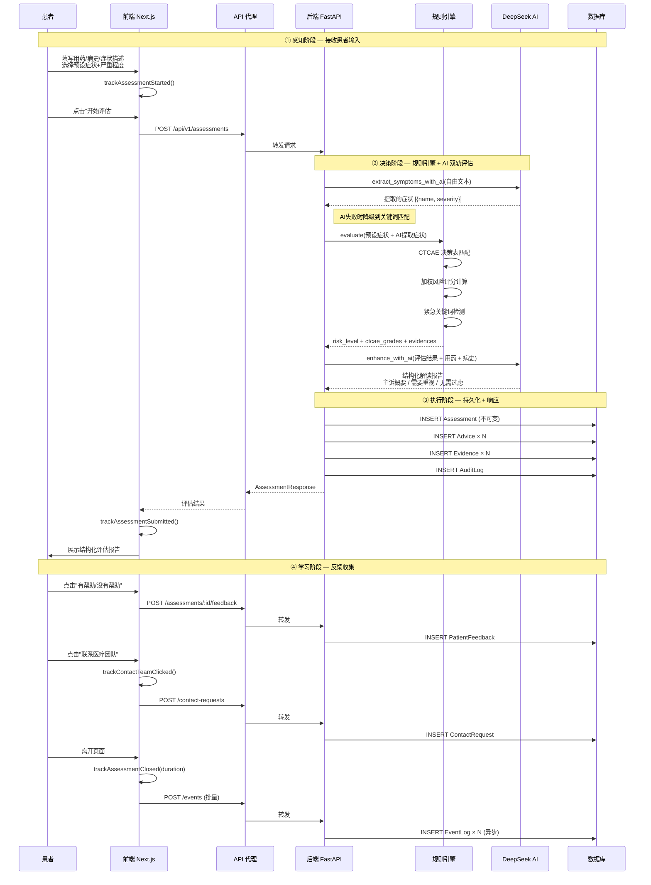

# 浅愈 (GentleMend)

乳腺癌副作用智能评估系统 — 规则引擎 + AI 增强的医疗决策辅助工具。

GitHub: https://github.com/MaxMiksa/GentleMend.git

## 快速开始

### 本地开发（推荐）

```bash
# 后端
cd backend
pip install -r requirements.txt
python -m uvicorn app.main:app --reload --port 8000

# 前端（新终端）
cd frontend
npm install
npm run build
npx next start -p 3000
```

默认使用 SQLite，无需安装 PostgreSQL/Redis。

启动后访问:
- 前端界面: http://localhost:3000
- API 文档: http://localhost:8000/docs

### AI 增强配置（可选）

在项目根目录 `.env` 中配置 AI API（支持 DeepSeek/OpenAI 兼容接口）：

```bash
AI_API_BASE_URL=https://api.deepseek.com/v1
AI_API_KEY=your-api-key
AI_MODEL=deepseek-chat
```

未配置时系统使用纯规则引擎模式，功能完整可用。配置后启用：
- AI 症状提取（从自由文本智能识别症状和严重程度）
- AI 结构化解读（主诉概要 + 重点关注 + 无需过虑 + 个性化建议）

### Docker 部署

```bash
make setup && make dev
```

## 架构概览

### 系统架构图



### 数据流图



### 智能体闭环：感知-决策-执行-学习

```mermaid
graph LR
    subgraph Perceive["① 感知"]
        P1["自由文本输入<br/>患者口语化描述"]
        P2["结构化输入<br/>预设症状 + 三级严重度"]
        P3["上下文信息<br/>用药方案 · 既往病史"]
        P4["AI 症状提取<br/>DeepSeek LLM"]
        P5["关键词降级<br/>37个中文→英文映射"]
    end

    subgraph Decide["② 决策"]
        D1["CTCAE 决策表<br/>44条版本化规则"]
        D2["风险分级<br/>Grade 1/2/3 匹配"]
        D3["加权评分<br/>max×0.6 + avg×0.4"]
        D4["紧急检测<br/>高热·出血·意识模糊"]
        D5["冲突消解<br/>多规则取最高风险"]
    end

    subgraph Execute["③ 执行"]
        E1["AI 结构化解读<br/>主诉·重点·安心·建议"]
        E2["风险可视化<br/>评分·等级·颜色区分"]
        E3["不可变快照<br/>Assessment 写入即锁定"]
        E4["审计日志<br/>规则ID·版本·置信度"]
        E5["协同触发<br/>高风险→联系医疗团队"]
    end

    subgraph Learn["④ 学习"]
        L1["患者反馈<br/>有帮助 / 没有帮助"]
        L2["行为事件<br/>5个埋点·session串联"]
        L3["隐式信号<br/>停留时长·是否联系团队"]
        L4["数据沉淀<br/>EventLog + Feedback"]
        L5["规则优化<br/>分析→调整→审核→灰度"]
    end

    P1 --> P4
    P2 --> D1
    P3 --> E1
    P4 -->|成功| D1
    P4 -->|失败| P5
    P5 --> D1

    D1 --> D2
    D2 --> D3
    D3 --> D4
    D4 --> D5
    D5 --> E1

    E1 --> E2
    E2 --> E3
    E3 --> E4
    E4 --> E5

    E2 --> L1
    E2 --> L2
    E5 --> L3
    L1 --> L4
    L2 --> L4
    L3 --> L4
    L4 --> L5
    L5 -.->|规则迭代| D1

    style Perceive fill:#E3F2FD,stroke:#1565C0
    style Decide fill:#FFF3E0,stroke:#E65100
    style Execute fill:#E8F5E9,stroke:#2E7D32
    style Learn fill:#F3E5F5,stroke:#6A1B9A
```



核心原则:
- 规则引擎作为确定性底线，AI 作为增强层（AI不可用时自动降级）
- 评估结果不可变，只追加新版本
- 每条建议可追溯到具体规则/依据
- 中英文双语支持

技术栈: Python 3.11 + FastAPI / SQLite (开发) + PostgreSQL 16 (生产) / Next.js 16 + React 19 / DeepSeek API

## 项目结构

```
GentleMend/
├── backend/
│   ├── app/
│   │   ├── ai/               # AI增强层 (症状提取 + 结构化解读 + 降级)
│   │   ├── api/              # API路由 (patients, assessments, events, contact_requests, feedback)
│   │   ├── db/               # 数据库配置 + 规则种子数据
│   │   ├── models/           # ORM模型
│   │   ├── rules/            # 规则引擎 (CTCAE决策表 + 加权评分)
│   │   ├── monitoring/       # 监控告警
│   │   └── main.py           # FastAPI入口
│   └── requirements.txt
├── frontend/
│   └── src/
│       ├── app/              # Next.js App Router (输入页/结果页/历史页)
│       │   └── components/   # 共享组件 (Nav, RiskBadge, Footer)
│       └── lib/
│           ├── api.ts        # 后端API客户端
│           ├── event-tracker.ts  # 事件埋点SDK
│           └── i18n/         # 国际化 (中/英文)
├── docs/                     # 设计文档 (PRD, SDD, 架构图)
├── docker-compose.yml        # 服务编排
└── .env.example              # 环境变量模板
```

## API 端点

| 方法 | 路径 | 说明 |
|------|------|------|
| POST | `/api/v1/patients/` | 创建患者 |
| POST | `/api/v1/assessments/` | 提交评估（含用药/病史/症状） |
| GET | `/api/v1/assessments/` | 评估历史列表 (分页+筛选) |
| GET | `/api/v1/assessments/{id}` | 查询评估详情 |
| POST | `/api/v1/assessments/{id}/feedback` | 患者反馈（幂等） |
| POST | `/api/v1/events/` | 事件埋点上报 |
| POST | `/api/v1/contact-requests/` | 联系团队请求 |

完整 API 文档: 启动后访问 http://localhost:8000/docs
