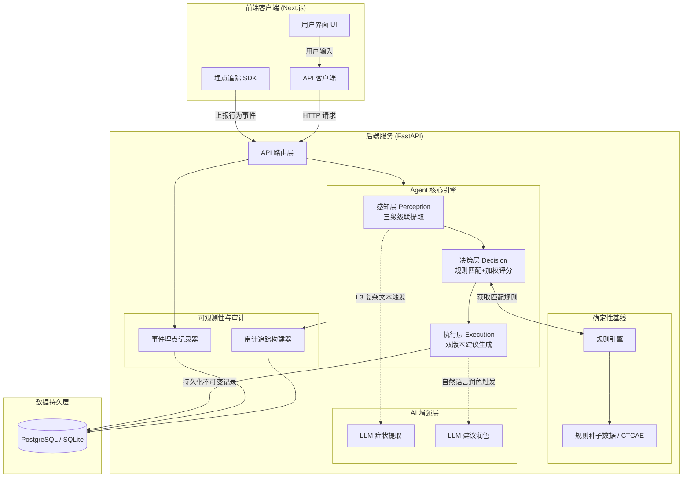
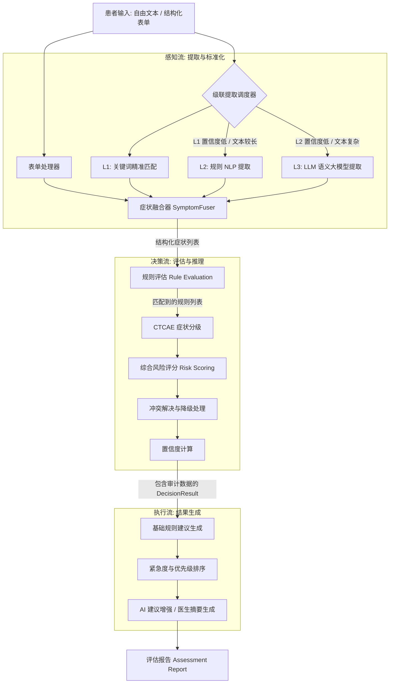
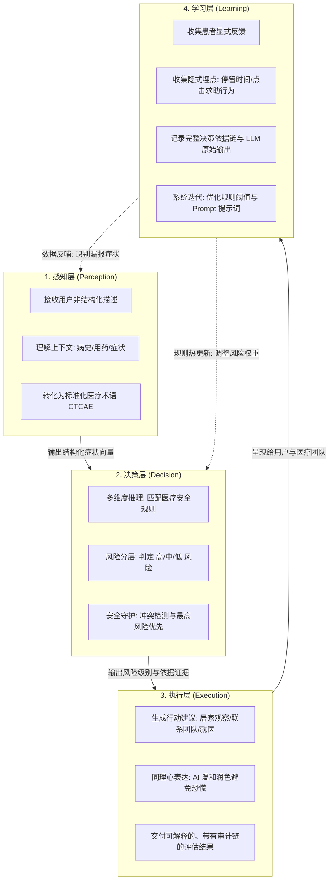

# 浅愈 (GentleMend) - 系统架构与数据流图

本文档提供了浅愈 (GentleMend) 系统的核心架构图、数据流图以及智能体闭环流程图。

## 1. 架构图 (Architecture Diagram)

该图展示了系统的整体分层架构，特别是“规则引擎（保底）+ AI 增强（提升）”的双轨设计。

---

## 2. 数据流图 (Data Flow Diagram)

该图详细描述了一次患者评估请求从输入到输出的完整管线数据流向。

---

## 3. 智能体闭环流程图 (Agent Closed-loop Flowchart)

该图展示了系统如何实现“感知 - 决策 - 执行 - 学习”的智能体完整闭环。

